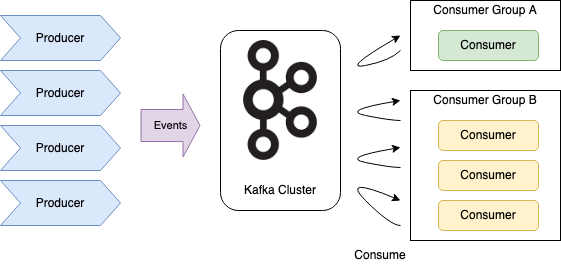
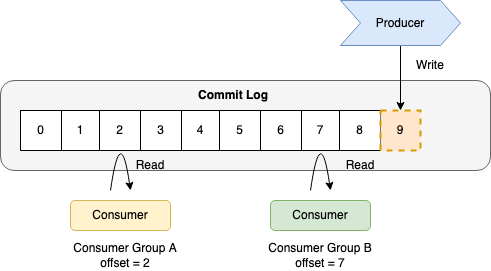
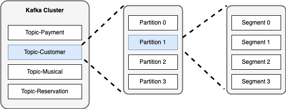
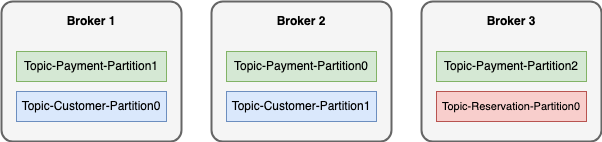
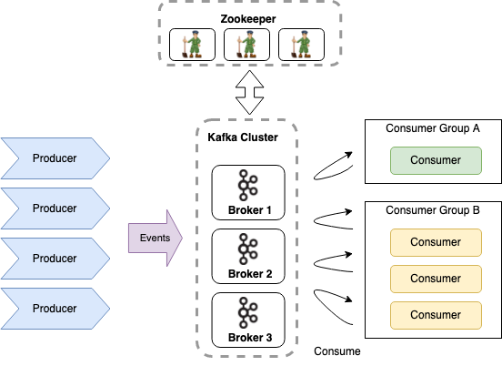

# Kafka의 정의 및 특징

**Kafka 란?**

- Event Streaming Platform. Event 제공자에게서 발생한 Event들을 소비자에게 전달.

- Event : 비즈니스 상에서 일어나는 모든 일(데이터)

- Event Stream : 연속적인 많은 이벤트들의 흐름

**Kafka의 특징**

- 이벤트 스트림을 안전하게 전송한다. Pub/Sub
- 이벤트 스트림을 디스크에 저장한다.
- 이벤트 스트림을 분석 및 처리할 수 있다

# Kafka 의 구성

- Topic : Kafka 안에서 메시지가 저장되는 논리적인 장소를 의미
- Producer : 메시지를 생산하여 Kafka 의 Topic으로 메시지를 보내는 애플리케이션
- Consumer : Topic의 메시지를 소비하는 어플리케이션
- Consumer Group : Topic의 메시지를 소비하기 위해 협력하는 Consumer들의 집합
  - 하나의 Consumer는 하나의 Consumer Group에 포함됨
  - Consumer Group 내의 Consumer들은 Topic 내 메시지를 분산 병렬처리한다.

# Kafka 의 기본 동작 방식

- Producer와 Consumer는 서로 알지 못하며, 각각 고유의 속도로 Commit Log에 Producing/ Consuming을 수행
- 다른 ConsumerGroup 에 속한 Consumer들은 서로 관련이 없으며 고유의 offset을 가지게 됨
- Commit Log : 추가만 가능하고 변경이 불가능한 데이터 구조. Event(데이터)는 항상 로그 끝에 추가되고, 변경할 수 없음.
- offset : Commit Log 에서 Event의 위치
- Consumer Lag : Consumer가 마지막으로 읽은 Event offset과 Producer가 마지막으로 쓴 Event의 offset의 차이를 의미함.
  - CURRENT-OFFSET : Consumer가 읽고 처리한 후 마지막으로 Commit 한 offset
  - LOG-END-OFFSET : Producer가 마지막으로 쓴 offset

# Topic, Partition, Segment

- Partition : Commit Log를 의미함. 하나의 Topic은 하나 이상의 Partition으로 구성
  - Topic 생성 시 Partition 개수를 지정하여 생성함
  - 각 Partition은 Broker 들에 분산되어 구성됨
  - 
- Segment : Event가 실제 저장되는 물리 File. 지정된 크기보다 크거나 지정된 기간보다 오래되면 새 파일로 Rolling 처리됨.

  - 각 Partition 당 하나의 Segment가 활성화 되어있음.

- 관련 Kafka Configuration

  - log.segment.bytes : Segment 파일 교체 크기 (default : 1GB)
  - log.roll.hours : Segment 파일 교체 기간 (default : 168시간)

  

# Broker, Zookeeper

**Kafka Broker**

- Partition에 대한 Read/Write를 관리하는 소프트웨어 (aka Kafka Server)
- Topic 내 Partition들을 분산, 유지 및 관리
- 각 Broker 들은 ID 로 식별 됨 (아이디는 숫자임.)
- Broker마다 각 Topic 별 Partition의 일부만 가짐. 
- Kafka Cluster : 여러개의 Broker로 구성된 구조를 의미함. (최소 3대, 권장 4대 이상)
- Client는 하나의 Broker에만 연결해도 모든 Broker endpoint를 얻을 수 있으나, 애초부터 broker list를 모두 Client에서 입력하는 것을 권장
- 각각의 Broker는 모든 Broker, Topic, Partition 들에 대하여 알고 있음.
  - 각 정보는 Zookeeper를 통해 최신상태를 유지함.

**Zookeeper**

- 분산 애플리케이션을 위한 코디네이션 시스템. (분산 합의, Meta Data 복제 등)
- Broker 들을 관리하는 용도로 사용됨 (Broker 간의 변경 정보 공유, 동기화 등)
- Kafka 를 구동하기 위해서는 필수로 사용됨. (2022년 말에는 zookeeper를 제거할 예정)
- 홀수로 구성해야 함 (최소 3대, 권장 5대)
- Zookeeper에는 한 대의 Leader(writes) 와 여러 대의 Followers(reads) 가 존재함.
- Quorum 알고리즘 기반으로 동작함 (과반수 기반 동작)
  - 3대 구성 -> Quorum : 2. 1대가 장애가 발생하더라도 정상 동작 가능함을 의미
  - 5대 구성 -> Quorum : 3. 2대가 장애가 발생하더라도 정상 동작 가능함을 의미
