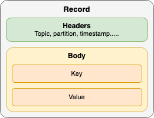
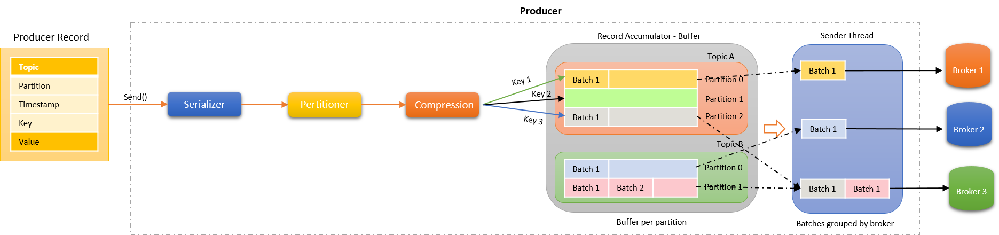
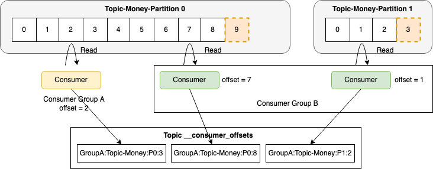
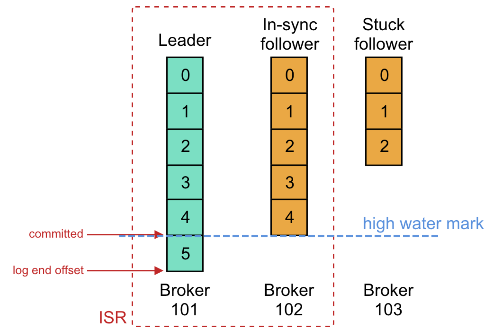

# Producer

Producer : 메시지를 생산하여 Kafka 의 Topic으로 메시지를 보내는 애플리케이션

## Kafka Record 구조

Record 란, kafka에서 Producer가 Producing 하는 Event를 의미함.

- Header : Record의 Meta data를 담고 있음. 
- Body : 실제 어플리케이션이 Producing 하고자 하는 Event. Key-Value 구조로 이루어져있다.
  - Key는 별도 설정하지 않으면 null 값이다.
  - Key 와 Value는 String, Avro, Json, byteArray 등 여러가지의 형태로 있을 수 있다.
- Kafka는 Record를 ByteArray로 Serialize 하여 저장함. Producer는 Serializer 가 필요하고, Consumer는 Deserializer가 필요하다.

- Key 와 Value는 Serializer, Deserializer에 대해 각각 설정이 가능하다.
- Record 필수 값
  - Topic 정보
  - Value 값

## Producer의 구조

- Serializer : send() 메서드가 호출되면 동작함. 다양한 형태의 Key,Value를 byteArray로 Serialize 한다.
- Partitioner : 메시지를 어떤 Partition으로 보낼 지 결정. 
  - Key 값이 있는 Record : 고유의 해싱 알고리즘을 기반으로 Partition을 결정함. 즉 key 가 같으면 같은 Partition에 배정할 수 있다.
    - Key 기준의 Record 순서를 보장해줄 수 있다.
  - Key 값이 없는 Record : Batch (한번에 밀어넣는 메시지들) 단위로 Partition에 메시지를 밀어넣게 됨. 이때 Partition 선정은 랜덤.

- Compress (optional) : compress 관련 조건이 있을 경우 압축을 실행
- RecordAccumulator : Record 배치 처리를 실행. 지정된 만큼 Record를 Batch Queue 에 저장.
- Sender : Record 배치들을 Broker에 전송.

# Consumer

Consumer : Topic의 메시지를 소비하는 어플리케이션

## Consumer Offset

- Consumer Group 이 읽은 위치를 표기하는 것
- __consumer_offsets 라는 Internal Topic에서 Consumer offset을 저장하여 관리함.

## Partition과 Consumer

- Partition : Consumer = N : 1
  - 하나의 Consumer가 모든 Partition에서 Consuming 하며, 각 Partition 별 offset을 기록/유지함
- Partition : Consumer = N : M
  - 하나의 Partition은 하나의 Consumer에 의해서만 사용됨
  - Consumer는 0~N개의 Partition을 담당할 수 있으나, 기본적으로 균등하게 Partition이 할당 됨
- 특정 Partition을 담당하던 Consumer에 장애가 생겼을 경우, 해당 Partition은 다른 Consumer에게 재분배됨.

## Partition과 순서 보장

**Partition 갯수와 순서 보장**

- Partition이 2개 이상인 경우 모든 Record에 대한 전체 순서는 보장할 수 없다.
- Partition 을 1개로 구성하면 모든 Record에 대해 순서보장은 되나 처리량 저하로 성능 문제가 발생한다.

**Partition과 Record Key에 의한 순서 보장** 

- Key를 활용하면 동일 Key에 대해서는 동일한 Partition으로 분배처리 하므로, 동일 Key 기준으로는 순서보장이 가능하다. (예 : 주문번호, 차량 아이디 등)
- 운영 중 Partition 개수를 변경하면 분배처리 해싱 알고리즘에 변동이 생기므로 순서보장이 불가능해짐. Partition은 Topic 생성 때 신중히 고려하여 생성할 것.
- Key는 단순한 Integer, String 값 이 외에도 Json, Avro 등 복잡한 형태도 가능.
- Key를 잘못 선정하면 (너무 적을 경우) 특정 Partition에만 Record가 몰려 작업 부하가 고르게 분배되지 않을 수 있음. 

# Replication

- 특정 Broker에 장애가 발생하였을 때 해당 Broker 내 할당되어있는 Partition들의 데이터 유실을 방지하려면?
- Partition을 복제하여 다른 Broker 상에서 복제물(Replicas)을 만들어 장애를 미리 대비하는 기능.
- Leader Partition, Follower Partition으로 나누어짐.
  - Leader : Producer/Consumer가 직접 데이터를 Pub/Sub 하는 Partition
  - Follower : Broker 장애시 안정성을 제공하기 위한 존재로, Leader의 Commit Log에서 데이터를 복제. (Fetch Request)
  - Leader에 장애 발생 시 Kafka 는 Follower 중 새로운 Leader를 선출함.
- Partition Leader 분산 기능이 존재함. (특정 Broker에 Leader가 몰려 부하가 심해지는 것을 방지)
  - auto.leader.rebalance.enable : Partition Leader Rebalancing 기능 enable 여부 (default : enable)
  - leader.imbalance.check.interval.seconds : Leader 분산 필요 여부를 체크하는 주기 (default : 300s)
  - leader.imbalance.per.broker.percentage : 다른 Broker 들보다 부하가 얼마나 더 많아야 재분산 대상이 되는지의 기준 (default : 10)
  - Rack Awareness
    - 물리적인 서버 Rack 에 대한 정보를 기입함으로서 Rack간 분산을 이루어질 수 있도록 하는 옵션
    - ex : broker.rack=ap-northeast-2a

## In-Sync Replicas

- High Water Mark 라고 하는 지점까지 동일한 Replicas들의 목록
- Leader 장애 발생 시 ISR 중에서 새로운 Leader를 선출함. 
- High Water Mark : 하나의 Follower에게라도 완전히 복제가 완료된 offset을 의미
- replica.lag.time.max.ms : follower가 Fetch Request를 보내는 Interval에 대한 옵션. 

## Partition Leader와 Controller

**Partition Leader**

- ISR은 Leader가 관리하며, Follower가 너무 느리면 Leader는 ISR 목록에서 해당 Follower를 제거하고 Zookeeper에 ISR을 유지함.

**Controller**

- Broker Liveness를 모니터링하는 역할을 담당하는 Broker
- Kafka Broker 중 하나가 Controller로 선발됨.
- Leader/Replica 정보 등 Metadata 에 대한 변경사항을 Zookeeper에게서 수신하여 다른 Broker들에게 전달함.
  - Zookeeper에 Replicas 복사본을 유지한 다음 더 빠른 액세스를 위해 클러스터의 모든 Broker들에게 동일한 정보를 캐싱함
- Leader 장애 시 Leader Elaction을 수행함
- Controller 장애 시 다른 Active Broker들 중에서 재선출됨

## Committed Offset

**offset 종류**

- Last committed offset(Current offset) : Consumer가 최종 commit 한 offset
- Current position : Consumer가 읽어간 위치 (처리중, Commit 전)
- High Water Mark : 하나의 Follower에게라도 완전히 복제가 완료된 offset
- Log end offset : Producer가 메시지를 보내서 저장된 로그의 맨 끝 offset

**committed**

- ISR 목록의 모든 Replicas가 메시지를 성공적으로 가져온 경우를 말함.
- committed 메시지는 모든 follower에서 동일한 offset을 갖도록 보장하며, consumer는 committed 메시지만 읽을 수 있다. 
  - 즉, 어떤 Broker가 Leader이든간에 모든 Consumer는 동일 offset에서 동일 데이터를 볼 수 있다.
- Broker의 모든 Partition에 대한 마지막 Committed offset은 replication-offset-checkpoint 라는 파일에 기록됨
  - Broker를 다시 시작하더라도 committed 메시지 목록을 유지할 수 있음.

**Leader Epoch**

- 새 Leader가 선출된 시점을 Offset으로 표시
- Broker 복구 중에 메시지를 체크포인트로 자른 다음 현재 Leader를 따르기 위해 사용됨
- Controller가 새 Leader를 선택하면 Leader Epoch를 업데이트하고 해당 정보를 ISR 목록의 모든 구성원에게 보냄
- leader-epoch-checkpoint 파일에 체크포인트를 기록

## Replication 과정

offset 5 까지 복제가 완료되었으며, Producer가 새 메시지를 전송한 상황이라고 가정

1. Leader는 offset 6에 메시지를 추가
2. 각 Follower들의 Fetcher Thread가 독립적으로 fetch를 수행하고 가져온 메시지를 offset 6에 추가
3. 각 Follower들의 Fetcher Thread가 독립적으로 다시 fetch를 수행하고 null을 받음
4. Leader는 High water mark를 이동시킴
5. 각 Follower들의 Fetcher Thread가 독립적으로 다시 fetch를 수행하고  High water mark를 받음